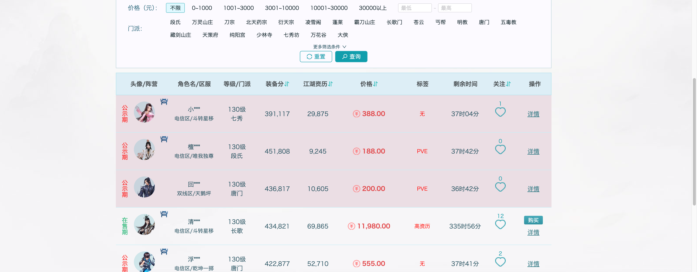

# wanbaolou-click-highlight

剑网三万宝楼点击高亮，项目灵感来源于最近回坑，去买角色的时候发现很不方便，因为每次点击价格相同我根本不知道有没点击这个。

工作原理，每次点击会将当前的项目进行高亮展示，但是不会持久记忆，也就是说当你分页变化或者刷新网页的话就会失去高亮的展示效果。

## 支持区域

- 角色购买页面
- 个人关注页面

## 使用方法

1. 下载 [Tampermonkey](https://www.tampermonkey.net/index.php?browser=chrome&locale=zh)（油猴）插件；
2. 安装 [剑网三万宝楼点击高亮](https://greasyfork.org/zh-CN/scripts/524003-%E5%89%91%E7%BD%91%E4%B8%89%E4%B8%87%E5%AE%9D%E6%A5%BC%E7%82%B9%E5%87%BB%E9%AB%98%E4%BA%AE)；
3. 重新进入万宝楼，或者刷新即可。

## 其他

如果有好的建议也可以交流 🙋。

## 协议

MIT License
